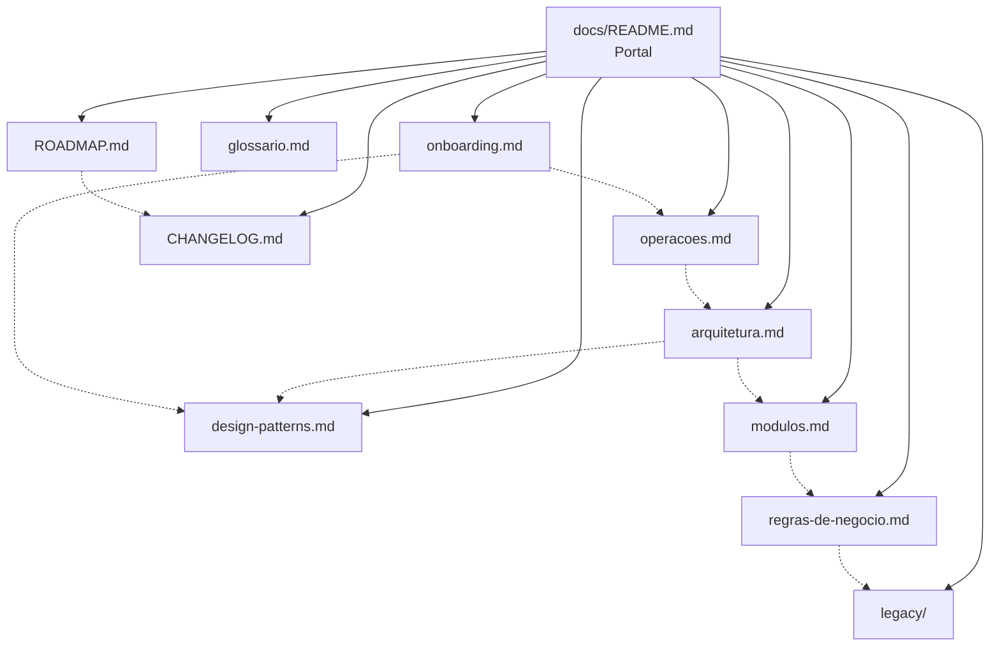

# Central DMF — Documentação Técnica

A **Central DMF** é uma plataforma desktop interna em Python que fornece autenticação, plugin system extensível, interface PyWebView e infraestrutura de comunicação (EventBus, SSO, Lock Cooperativo). A plataforma hospeda serviços de automação de back-office contábil; cada serviço é um processo independente que se acopla à Central sem alterar seu núcleo.

A **Automação de Horas** é o primeiro serviço acoplado: um processo 32-bit que conecta ao ERP Domínio Sistemas via ODBC, processa as regras de negócio dos setores Fiscal, DP e Contábil, e alimenta a planilha master de controle de horas no OneDrive corporativo. Outros serviços seguirão o mesmo padrão de integração.

**Status atual:** Piloto em produção — versão 0.2.0 com os 5 supervisores, usando a Automação de Horas como serviço inicial.

---

## Índice de Navegação

| Documento | Descrição |
|---|---|
| [arquitetura.md](arquitetura.md) | Visão de contexto, componentes, SSO, deployment e decisões arquiteturais |
| [design-patterns.md](design-patterns.md) | Plugin System, EventBus, Lock Cooperativo, SSO, Padrões A/B/C, Frozen Mode |
| [modulos.md](modulos.md) | Catálogo de módulos: AutomacaoHoras, Fiscal, DP, Contábil |
| [regras-de-negocio.md](regras-de-negocio.md) | **Fonte da verdade ativa** — regras de cálculo por setor e planilha master |
| [operacoes.md](operacoes.md) | Build, deploy, segurança, observabilidade e troubleshooting |
| [onboarding.md](onboarding.md) | Setup local, padrões de código, branches, pipeline e checklists |
| [glossario.md](glossario.md) | Termos do domínio: GELOGUSER, Master, Lock, SSO, Padrão A/B/C... |
| [CHANGELOG.md](CHANGELOG.md) | Histórico de versões (Keep a Changelog) — atual: v0.2.0 |
| [ROADMAP.md](ROADMAP.md) | Backlog técnico, decisões em aberto, próximos serviços |
| [legacy/README.md](legacy/README.md) | Documentação histórica — não usar como fonte da verdade ativa |

---

## Mapa de Relacionamento

O diagrama abaixo mostra como os documentos se relacionam.

---

## Por Onde Começar

| Objetivo | Documento recomendado |
|---|---|
| Entender a arquitetura do sistema | [arquitetura.md](arquitetura.md) |
| Configurar o ambiente e começar a contribuir | [onboarding.md](onboarding.md) |
| Entender uma regra de negócio (Fiscal, DP, Contábil) | [regras-de-negocio.md](regras-de-negocio.md) |
| Fazer build e distribuir uma nova versão | [operacoes.md](operacoes.md) |
| Entender um padrão técnico (Lock, SSO, EventBus) | [design-patterns.md](design-patterns.md) |
| Decodificar um termo desconhecido | [glossario.md](glossario.md) |

---

## Como Contribuir

Consultar [onboarding.md](onboarding.md) para setup do ambiente, padrões de código, estratégia de branches e o pipeline completo do zero à produção.

## Status Atual

Versão **0.2.0** em produção. Histórico completo em [CHANGELOG.md](CHANGELOG.md). Próximos passos em [ROADMAP.md](ROADMAP.md).

---

*Última atualização: 2026-05-29*
