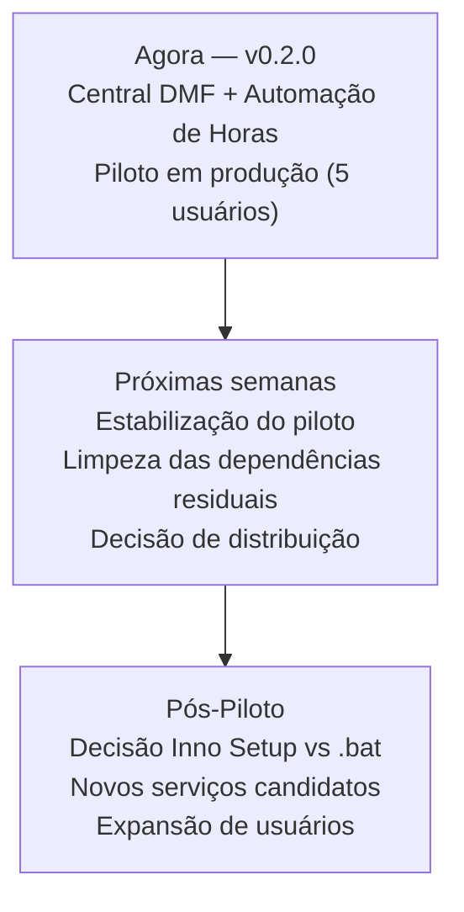

# Roadmap

> Visão consolidada do que vem a seguir: backlog técnico, decisões em aberto e próximos serviços candidatos.

---

## Sumário

1. [Plataforma em Expansão](#1-plataforma-em-expansão)
2. [Backlog Técnico](#2-backlog-técnico)
3. [Limpeza das Dependências Residuais da Central](#3-limpeza-das-dependências-residuais-da-central)
4. [Pós-Piloto — Distribuição](#4-pós-piloto--distribuição)
5. [Próximos Serviços Candidatos](#5-próximos-serviços-candidatos)
6. [Decisões em Aberto](#6-decisões-em-aberto)

---

## 1. Plataforma em Expansão

A Central DMF deixou de ser a "ferramenta de horas" e passou a ser uma plataforma que hospeda múltiplos serviços. A Automação de Horas é o primeiro serviço acoplado. O diagrama abaixo ilustra a trajetória.

O posicionamento como plataforma é a decisão arquitetural mais importante da v0.2.0 — ela define que qualquer novo serviço setorial seguirá o mesmo padrão de launcher + SSO, sem alterar a plataforma central.

---

## 2. Backlog Técnico — Automação de Horas (Serviço 1)

> Backlog do primeiro serviço. Melhorias na infraestrutura da plataforma Central DMF estão documentadas na Seção 3 (limpeza de dependências residuais).

### Epic 1 — Módulo Contábil: Refinamento

- **Integração real do Contábil**: substituir o comportamento de simulação (`scratch/integrar_contabil_onedrive.py`) pelo conector real do OneDrive/SharePoint na interface.
- **Mapeamento de Peso Múltiplo**: implementar a regra de peso métrico por lançamento (ex.: 0.5 min por lançamento) e presença de extrato (`orig_lan=39`).
- **Validação de Sincronia**: garantir que a leitura da aba `MM.AAAA` valide se os dados do cliente batem com o CNPJ do Domínio antes de confirmar.

### Epic 2 — Módulo Fiscal: Estabilização

- **Tratamento de Dados Nulos**: queries ODBC que retornem `NULL` ou tempos não computados não podem quebrar a injeção na planilha.
- **Revisão da Regra dos 80%**: validar se o acréscimo está refletindo corretamente na coluna O para todos os `GELOGUSER`.
- **Limpeza de Fantasmas**: assegurar que clientes sem horas fiscais no mês atual tenham o registro zerado (remover resíduos do mês anterior).

### Epic 3 — UI: Polimento

- **Exibição Dinâmica do Log**: parsear o log em tempo real na tela de Relatório (hoje só mostra status final).
- **Tratamento de Exceções na Tela**: pop-up amigável quando a planilha master estiver aberta por outro usuário.

### Em Validação

- **Resiliência da Planilha Master**: testes do `master_writer.py` para garantir que o preenchimento não quebre as fórmulas complexas (coluna R, totais) do `.xlsm`.
- **Filtros de Parâmetros na UI**: validar se competência e acréscimos salvos pelo usuário estão sendo aplicados nas queries.
- **Lock Cooperativo Multi-usuário**: simular dois supervisores em paralelo e validar a mensagem amigável de "Outro usuário está gravando".

---

## 3. Limpeza das Dependências Residuais da Central

A Central DMF ainda importa de `engine/` (raiz) para as seguintes funcionalidades:

| Funcionalidade | Arquivo importado |
|---|---|
| Dashboard de estado | `engine/estado_compartilhado.py` |
| Diagnóstico ODBC | `engine/database.py` |
| Status do lock | `engine/lock_master.py` |
| Leitura da master | `engine/excel_parser.py` |

Acreditava-se que essas dependências obrigavam a Central a rodar em Python 32-bit. **Isso foi investigado e é falso** (2026-06).

**Descoberta:** a restrição de 32-bit vinha *apenas* do acesso ao banco do Domínio via o **DSN ODBC "Contabil"**, registrado como 32-bit no Windows. O banco é **SAP SQL Anywhere 17**, que tem driver 64-bit já instalado. Conexão 64-bit **comprovada** trocando `DSN=Contabil` por connection string **DSN-less** (`DRIVER=SQL Anywhere 17;...`). Nada mais no projeto exige 32-bit.

**Abordagem (revisada — mais simples que API REST/IPC):** migrar a camada de banco para DSN-less, mover a Central para 64-bit, e embutir a Automação de Horas como **módulo inline** (Padrão 0, como o Buscar XML) — eliminando subprocesso, token SSO por arquivo e a infra triplicada de uma vez. Não é mais necessária uma API REST/IPC entre Central e Automação.

➡️ **Guia de implantação passo a passo:** [`docs/migracao-64bit.md`](migracao-64bit.md). Connection string validada e credencial real (UID=`EXTERNO`, não `dba`) estão lá.

Esta limpeza é pré-requisito para qualquer módulo futuro que precise de bibliotecas 64-bit na Central.

---

## 4. Pós-Piloto — Distribuição

Após o piloto com os 5 usuários reais (Carol, James, Nayane, Jailton, Adriele), avaliar a forma de distribuição.

### Opção A — Inno Setup (instalador `.exe` único)

- Empacota `dist/DMF Engine/` em um único `Setup_DMF_Engine.exe`.
- Aparece em "Adicionar/Remover Programas".
- Atalhos automáticos no Menu Iniciar + Área de Trabalho.
- Suporta uninstall limpo e versionamento (mostra delta de versão).
- Permite assinatura digital para silenciar o SmartScreen.

### Opção B — Manter o `.bat` Aprimorado

- Sem nova dependência de ferramenta externa.
- Acrescentar arquivo `VERSION` em `_internal/`.
- O `.bat` compara a versão instalada com a da rede e informa o delta.
- Notificação dentro do dashboard quando nova versão estiver disponível.

**Critério de decisão:** se os 5 usuários conseguirem usar o `.bat` sem fricção, manter Opção B. Se houver atrito (usuários que não encontram o `.bat`, que não entendem "instalar", ou se o sistema expandir para mais usuários), migrar para Opção A.

---

## 5. Módulos Ativos na Central DMF

| Módulo | Setor | Status | Notas |
|---|---|---|---|
| `automacao_horas` | GESTÃO | Produção (piloto 5 usuários) | Subprocess 32-bit — candidato à migração inline (ver Seção 3) |
| `relatorio_rendimentos` | CONTÁBIL | Produção | Padrão 0 inline |
| `sem_movimento_nfse` | FISCAL | Produção | Padrão A, Anti-Captcha, Playwright |

---

## 6. Próximos Serviços Candidatos

| Serviço | Descrição | Padrão de Integração |
|---|---|---|
| `buscador_xml` | Busca e processamento de XMLs fiscais | Padrão A (Python externo) |
| Novos setores | Legalização, Consultoria, outros setores da DMF | Módulos dentro da Automação ou novo serviço |
| Dashboard consolidado | Visão executiva de produtividade (exportação PDF/Excel) | Módulo UI na Central |

Cada novo serviço deve seguir o padrão estabelecido: launcher na Central + serviço em `services/` + eventos via EventBus.

---

## 7. Decisões em Aberto

| Decisão | Contexto | Critério |
|---|---|---|
| Inno Setup vs `.bat` | Distribuição pós-piloto | Feedback dos 5 usuários do piloto |
| Repositório único vs separado para novos serviços | Hoje: tudo no mesmo repo | Serviço com ciclo de vida independente → repo separado |
| Migração para 64-bit unificado | Quando abordar (guia pronto em [`migracao-64bit.md`](migracao-64bit.md)) | Janela segura — `automacao_horas` em produção com 5 usuários |
| ~~Exposição da API da Automação~~ | **Resolvido:** com 64-bit unificado a Automação vira módulo inline; não precisa de API entre processos | — |

---

*Última atualização: 2026-06-04*
