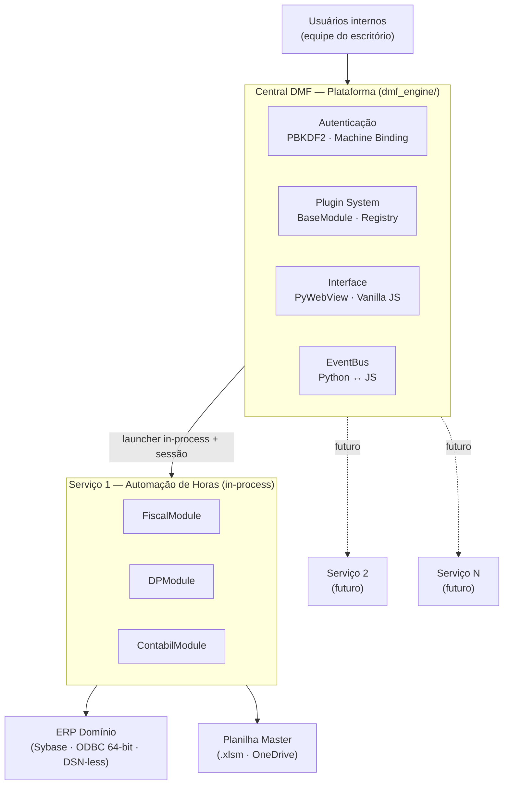
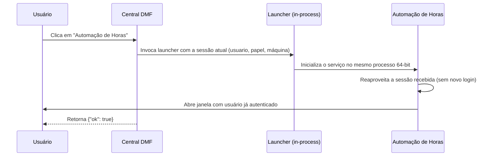
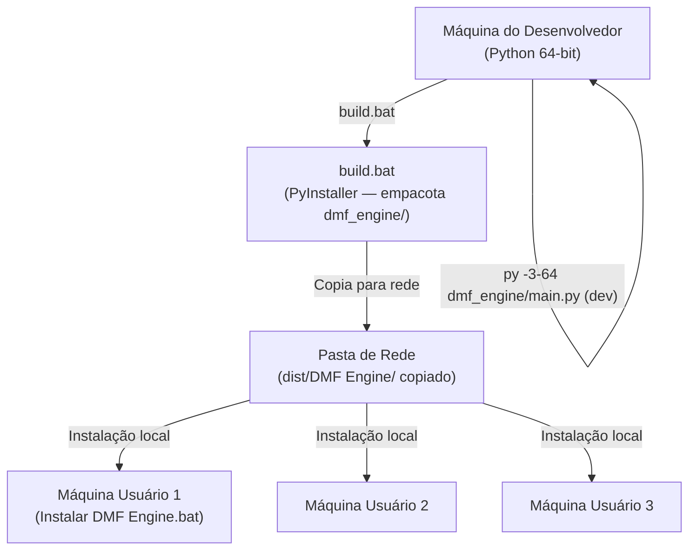
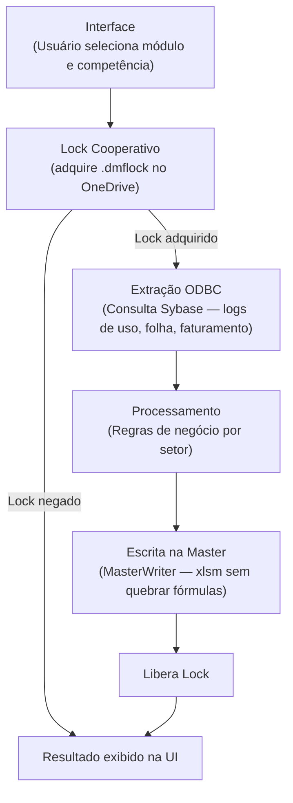

# Arquitetura — Central DMF

> Documento técnico-executivo da plataforma. Descreve contexto, componentes, comunicação, deployment e decisões arquiteturais.

---

## Sumário

1. [Visão de Contexto](#1-visão-de-contexto)
2. [Componentes](#2-componentes)
3. [Comunicação entre Componentes — Sessão Compartilhada](#3-comunicação-entre-componentes--sessão-compartilhada)
4. [Deployment](#4-deployment)
5. [Fluxo de Dados — Automação de Horas (Serviço 1)](#5-fluxo-de-dados--automação-de-horas-serviço-1)
6. [Estado de Transição da Central](#6-estado-de-transição-da-central)
7. [Decisões Arquiteturais](#7-decisões-arquiteturais)

---

## 1. Visão de Contexto

A **Central DMF** é uma plataforma desktop interna que fornece autenticação, plugin system extensível e infraestrutura para serviços de back-office do escritório DMF. Cada serviço acoplado à plataforma opera de forma independente, integrando sistemas externos — como o ERP Domínio e o OneDrive — conforme sua própria lógica, sem impactar o núcleo da plataforma.

O diagrama abaixo representa a Central DMF como plataforma extensível com seus componentes internos e os serviços que hospeda. A Automação de Horas é o Serviço 1; novos serviços se integram pelo mesmo mecanismo de launcher in-process, reaproveitando a sessão da Central, sem modificar a plataforma.

---

## 2. Componentes

### Central DMF

A Central DMF é a **camada de plataforma**: interface gráfica, autenticação, plugin system e orquestração. Não contém lógica de negócio setorial.

| Diretório | Responsabilidade |
|---|---|
| `dmf_engine/main.py` | Bootstrap: carrega componentes, registra módulos, abre janela PyWebView |
| `dmf_engine/api.py` | Bridge JS ↔ Python: dispatcher genérico de chamadas do frontend |
| `dmf_engine/auth.py` | Autenticação: PBKDF2-SHA256, machine binding, sessão por papel |
| `dmf_engine/core/` | EventBus, ThreadRunner, ConfigManager — infraestrutura da plataforma |
| `dmf_engine/modules/` | Plugin system: BaseModule, ModuleRegistry e adaptadores de módulo |
| `dmf_engine/ui/index.html` | SPA frontend: dashboard, telas de setor, execução de módulos |

### Automação de Horas

A Automação de Horas é o **primeiro serviço acoplado à plataforma**. Roda **in-process** no mesmo executável 64-bit da Central — um launcher abre a janela do serviço reaproveitando a sessão já autenticada, sem subprocesso separado.

| Diretório | Responsabilidade |
|---|---|
| `services/automacao_horas/main.py` | Bootstrap standalone do serviço (execução direta em dev) |
| `services/automacao_horas/engine/` | ODBC, planilha master, lock cooperativo, estado compartilhado |
| `services/automacao_horas/modules/` | Adaptadores Fiscal, DP e Contábil (herdam BaseModule) |
| `services/automacao_horas/modulos/` | Lógica de negócio pura por setor (sem UI, sem threading) |

### Separação de Responsabilidades

| Camada | Diretório | O que faz | Pode importar de |
|---|---|---|---|
| Plataforma | `dmf_engine/core/` | EventBus, threads, config | — (base) |
| Bridge | `dmf_engine/api.py` | Dispatcher JS ↔ Python | `core/`, `modules/` |
| Plugin System | `dmf_engine/modules/` | Contrato, registro, dispatch | `core/`, regras |
| Regras | `modulos/` | Lógica de negócio pura | `engine/` apenas |
| Infraestrutura | `engine/` | Banco, arquivo, lock, estado | — (base) |

**Regra crítica:** `modulos/` jamais importa de `dmf_engine/`. A lógica de negócio deve funcionar sem a janela PyWebView.

---

## 3. Comunicação entre Componentes — Sessão Compartilhada

A Automação de Horas roda no mesmo processo da Central. Não há login duplo nem troca entre processos: o launcher recebe a sessão já autenticada da Central e abre a janela do serviço reaproveitando-a diretamente.

O diagrama abaixo descreve o fluxo desde a ação do usuário até a abertura da janela da Automação.

Como tudo ocorre no mesmo processo, não há token temporário nem janela de expiração: a sessão da Central é a fonte única de autenticação.

---

## 4. Deployment

O sistema opera em duas configurações: **desenvolvimento** (repositório clonado, Python direto) e **produção** (binário compilado com PyInstaller, distribuído pela rede corporativa).

### Frozen Mode

Em produção (binário compilado), o PyInstaller altera a estrutura de diretórios. O código distingue as duas situações:

| Variável | Desenvolvimento | Produção (frozen) |
|---|---|---|
| `BASE_DIR` | Diretório do `main.py` | Diretório do `.exe` |
| `RESOURCES_DIR` | Idem `BASE_DIR` | `sys._MEIPASS/dmf_engine/` (assets empacotados) |
| `PROJECT_ROOT` | Raiz do repositório | Diretório do `.exe` |

`BASE_DIR` é usado para **escrita** (logs, config.json). `RESOURCES_DIR` é usado para **leitura de assets** (HTML, ícone). Essa distinção é obrigatória — assets em `_MEIPASS` são somente-leitura.

---

## 5. Fluxo de Dados — Automação de Horas (Serviço 1)

> Este fluxo é específico do primeiro serviço acoplado à plataforma. Cada serviço futuro implementará seu próprio pipeline de dados.

O usuário interage com a Central DMF, seleciona o módulo Automação de Horas e dispara a execução. O serviço roda no mesmo processo 64-bit da Central, extrai dados do ERP, processa as regras de negócio por setor e escreve na planilha master. O sistema garante acesso exclusivo à planilha durante a escrita via lock cooperativo.

---

## 6. Estado de Transição da Central

A Central DMF foi desacoplada da execução Fiscal/DP/Contábil (v0.2.0), mas **mantém dependências residuais** em `engine/` para as seguintes funcionalidades:

| Funcionalidade | Dependência residual | Justificativa |
|---|---|---|
| Dashboard de estado | `engine/estado_compartilhado.py` | Lê o JSON de estado multi-usuário |
| Diagnóstico ODBC | `engine/database.py` | Testa conectividade |
| Lock status | `engine/lock_master.py` | Verifica se a master está ocupada |
| Leitura da master | `engine/excel_parser.py` | Exibe informações na tela principal |

Essas dependências **não são o design final**. A limpeza está registrada em [`ROADMAP.md`](ROADMAP.md) como evolução futura — a Central deve consumir essas informações pela camada de serviço da Automação, sem importar `engine/` diretamente.

A Central roda em **Python 64-bit**. A antiga amarra de 32-bit — que motivou o desacoplamento original — foi removida quando se confirmou que o driver ODBC do Domínio (SQL Anywhere 17) tem versão 64-bit; a conexão passou a ser DSN-less (DRIVER + host + porta). Ver [`migracao-64bit.md`](legacy/migracao-64bit.md).

---

## 7. Decisões Arquiteturais

| Decisão | Alternativas descartadas | Justificativa |
|---|---|---|
| **PyWebView** como UI | Electron, Flet | Electron: +150MB de overhead para app sem internet. Flet: travava com PyInstaller + driver ODBC. |
| **Vanilla JS** (sem framework) | React, Vue | PyInstaller empacota `index.html` estático; frameworks exigem `npm build` e `node_modules` a cada deploy. |
| **Python 64-bit + ODBC DSN-less** | Python 32-bit (DSN) | O driver do SQL Anywhere 17 (Domínio) tem versão 64-bit. Conexão via DRIVER+host+porta dispensa DSN por máquina. A amarra histórica de 32-bit foi removida — ver [`migracao-64bit.md`](legacy/migracao-64bit.md). |
| **Plugin Module System** | Monolito | `main.py` atingiu 1.771 linhas. Novo módulo = 1 arquivo + 1 linha de registro. `main.py` não é editado para novas funcionalidades. |
| **Lock via `.dmflock`** | SQLite, banco | OneDrive sincroniza arquivos; `open(path, 'x')` é atômico no Windows. Sem dependência extra. |
| **config.json** | Banco de dados | Volume pequeno, fácil de inspecionar, backup manual trivial, zero dependência extra. |
| **Mesmo repositório** | Repos separados | Todos os componentes são deployados juntos; um único `build.bat` gera tudo. |

---

*Última atualização: 2026-06-18*
