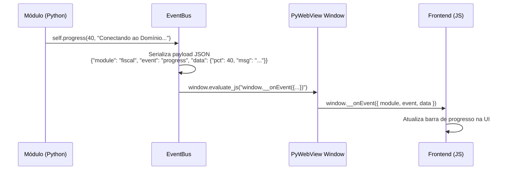
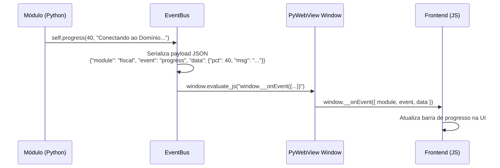
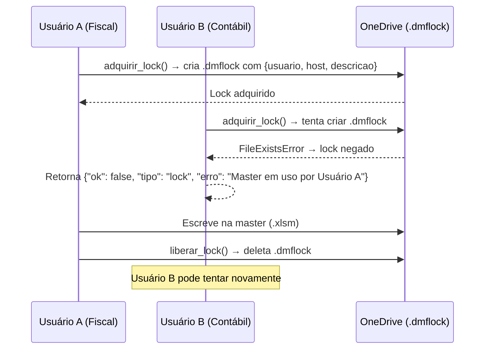
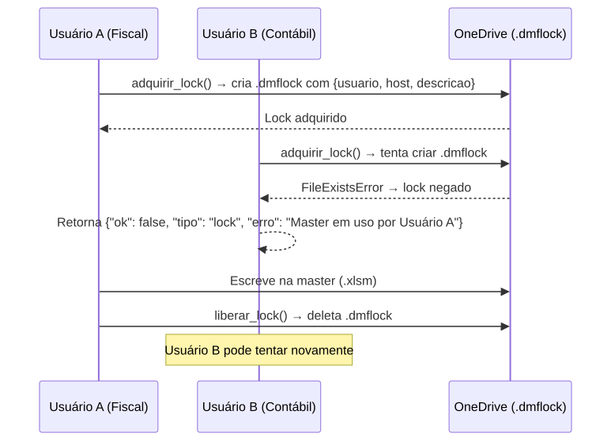
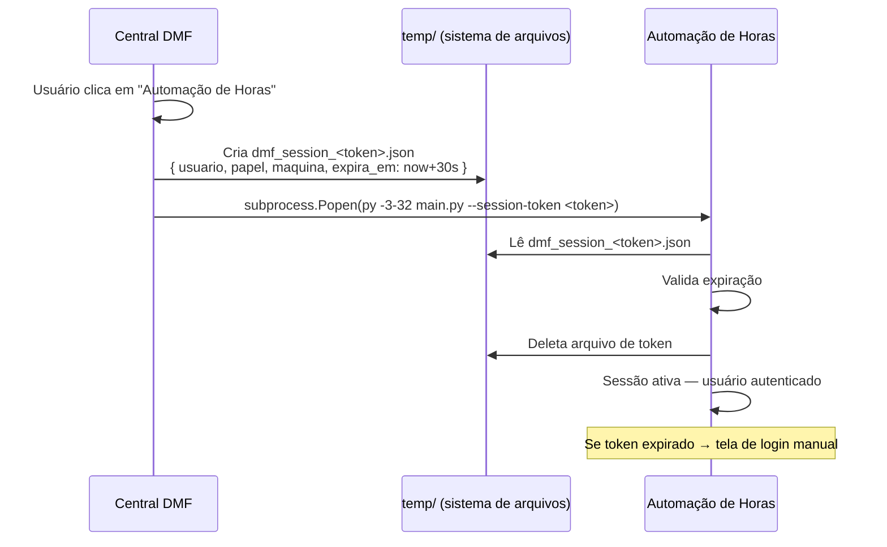
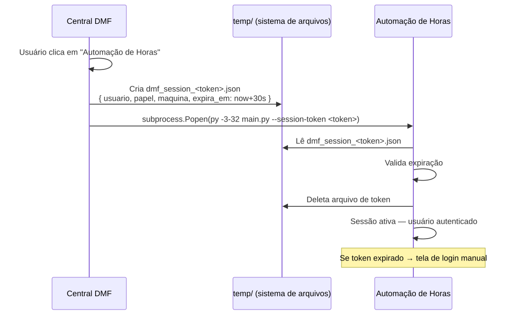
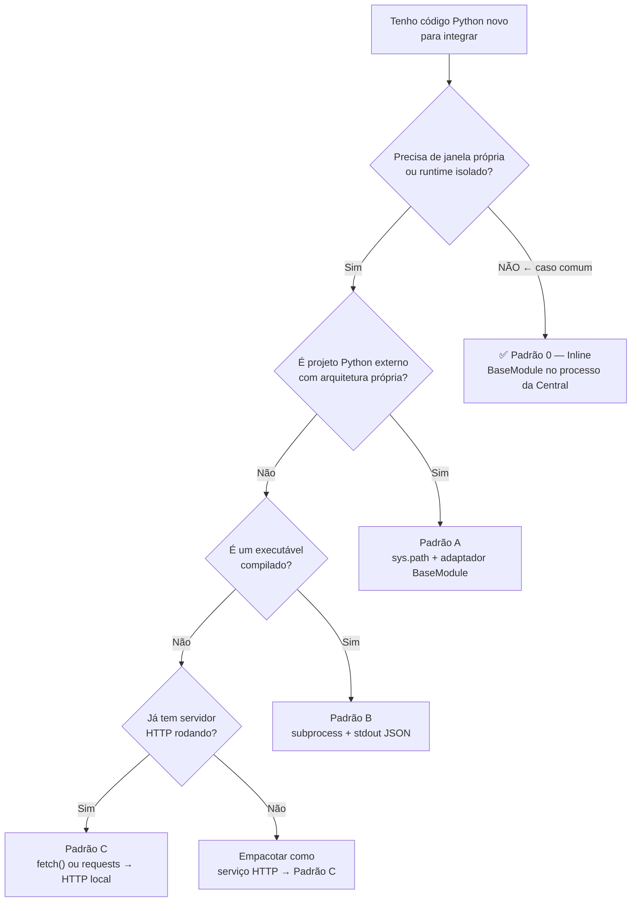

# Padrões e Decisões Técnicas

> Catálogo dos padrões aplicados na Central DMF: quando usar, como funciona e exemplos mínimos. Consultar antes de qualquer nova integração.

---

## Sumário

1. [Plugin System — BaseModule, ModuleMeta, ModuleRegistry](#1-plugin-system--basemodule-modulemeta-moduleregistry)
2. [EventBus — Comunicação Python → JS](#2-eventbus--comunicação-python--js)
3. [Lock Cooperativo](#3-lock-cooperativo)
4. [SSO por Token](#4-sso-por-token)
5. [Padrão 0 — Módulo Inline ← DEFAULT](#5-padrão-0--módulo-inline)
6. [Padrão A — Projeto Python Externo](#6-padrão-a--projeto-python-externo)
7. [Padrão B — Binário Compilado](#7-padrão-b--binário-compilado)
8. [Padrão C — Serviço HTTP Local](#8-padrão-c--serviço-http-local)
9. [Frozen Mode](#9-frozen-mode)
10. [Imports Lazy](#10-imports-lazy)
11. [Contrato de Retorno](#11-contrato-de-retorno)

---

## 1. Plugin System — BaseModule, ModuleMeta, ModuleRegistry

A Central DMF cresceu de um monolito (`main.py` com 1.771 linhas) para um sistema de plugins: cada módulo é um arquivo independente que herda um contrato e se registra com uma linha. O `main.py` nunca precisa ser editado para adicionar funcionalidades.

O plugin system tem três partes:

- **`ModuleMeta`** (dataclass): identidade do módulo — id, nome, setor, papéis, ícone, cor.
- **`BaseModule`** (ABC): contrato — toda classe de módulo implementa `meta` e `execute(opcoes)`.
- **`ModuleRegistry`**: catálogo em memória que registra módulos, despacha execuções em threads e expõe o catálogo para o frontend renderizar os cards.

```python
# Registrar um novo módulo em main.py — uma única linha:
registry.register(MeuNovoModule(bus, config, sessao_fn))
```

O `execute(opcoes)` é sempre chamado em thread separada via `ThreadRunner`. O módulo nunca bloqueia a UI.

---

## 2. EventBus — Comunicação Python → JS

A Central DMF precisa enviar eventos do Python para o JavaScript enquanto um módulo executa (progresso, erros, resultado final). O EventBus é o **único canal** para essa comunicação.

Todos os módulos chamam `self.emit(evento, dados)` ou `self.progress(pct, msg)` em vez de invocar `window.evaluate_js()` diretamente. Isso desacopla os módulos da janela PyWebView — um módulo não precisa saber que existe uma janela.

O diagrama abaixo mostra o fluxo de um evento de progresso desde o módulo até a UI.





O JS recebe todos os eventos pela mesma função `window.__onEvent`, independente do módulo que os emitiu. O campo `module` identifica a origem.

---

## 3. Lock Cooperativo

Quando dois supervisores executam módulos diferentes ao mesmo tempo e ambos tentam escrever na planilha master (`.xlsm`), o arquivo pode ser corrompido. O lock cooperativo previne isso.

O lock usa um arquivo `.dmflock` criado atomicamente no mesmo diretório da planilha master no OneDrive. A operação `open(path, 'x')` é atômica no Windows: apenas um processo consegue criar o arquivo; o segundo recebe `FileExistsError`.

O diagrama abaixo ilustra o cenário de dois usuários concorrentes.





O lock é **sempre liberado no `finally`** — mesmo em caso de exceção. Não liberar o lock bloqueia todos os outros usuários permanentemente.

---

## 4. SSO por Token

A Central DMF e a Automação de Horas são processos separados. Para evitar login duplo, a Central gera um token temporário que transfere a sessão ao processo filho.

O token é um arquivo JSON em `temp/` com validade de 30 segundos. O arquivo é deletado pelo processo filho após consumo — mesmo que o prazo não tenha expirado.





**Por que arquivo e não socket ou pipe?** Arquivos temporários funcionam entre processos sem configuração de rede local. São simples, auditáveis e eliminados pelo sistema operacional se o processo filho nunca iniciar.

---

## 5. Padrão 0 — Módulo Inline

**Este é o padrão default.** Use-o para qualquer código Python novo que não precise de janela própria, daemon ou binário externo. O `execute()` roda no mesmo processo da Central DMF via `ThreadRunner` — nenhum subprocess, nenhuma janela nova, nenhum SSO token.

**Quando usar:** módulo Python puro que lê/escreve dados e retorna resultado (ODBC queries, geração de Excel, leitura de planilhas, cálculos). Este foi o padrão correto para `relatorio_rendimentos`.

**Quando NÃO usar:** quando o código precisa de Python 64-bit e a Central ainda roda em 32-bit (use Padrão A com subprocess separado), ou quando precisa de UI interativa rica que não cabe no modal da Central.

```python
# dmf_engine/modules/m_meu_modulo.py
class MeuModulo(BaseModule):

    @property
    def meta(self) -> ModuleMeta:
        return ModuleMeta(id="meu_modulo", nome="Meu Módulo", setor="CONTÁBIL", ...)

    def execute(self, opcoes: dict) -> dict:
        import traceback, logging
        # Imports pesados DENTRO de execute() — ver Padrão 9 (Imports Lazy)
        from meu_pacote.logica import processar

        try:
            self.progress(10, "Iniciando...")
            resultado = processar(opcoes)
            self.progress(100, "Concluído.")
            return {"ok": True, "total": resultado}
        except Exception as e:
            logging.getLogger("MeuModulo").error(traceback.format_exc())
            return {"ok": False, "erro": str(e)}
```

Registrar em `dmf_engine/main.py` com uma linha:
```python
_registry.register(MeuModulo(_bus, _config, _sessao_fn))
```

---

## 6. Padrão A — Projeto Python Externo

**Quando usar:** código Python com arquitetura própria que não faz sentido reescrever (ex.: `buscador_xml`). O adaptador injeta o caminho do projeto externo no `sys.path` e importa o serviço principal de forma lazy.

```python
# Estrutura mínima — adaptador em dmf_engine/modules/m_meu_projeto.py
def _get_service(self):
    import sys
    if _EXT_PATH not in sys.path:
        sys.path.insert(0, _EXT_PATH)
    from meu_projeto.service import MeuService
    return MeuService(callback=lambda ev, d: self._bus.emit(self.meta.id, ev, d))
```

O callback `lambda ev, d` traduz eventos internos do projeto externo para o EventBus do DMF — a UI não sabe que o código é externo.

> ⚠️ **Regra anti-colisão de pacotes (obrigatória).** Como o adaptador injeta o
> projeto em `sys.path`, os nomes de pacote do projeto **passam a competir** com os
> da raiz da Central. A raiz já tem `engine/`, `config/`, `core/`, `modules/`.
> Se o projeto externo usar esses mesmos nomes, o Python resolve para o pacote da
> Central (cacheado primeiro em `sys.modules`) e os imports do projeto quebram com
> `ModuleNotFoundError` — frequentemente engolido por um `except`, deixando o módulo
> "vazio" ou inerte sem erro visível. **Renomeie os pacotes do projeto com um prefixo
> exclusivo** (ex.: `bx_engine/`, `bx_config/` no Buscar XML). Separe também a pasta
> de **dados de runtime** de qualquer pacote de **código** (ex.: dados em `bx_data/`,
> nunca em `config/`). Ver memória `colisao-pacotes-engine-config`.

---

## 6. Padrão B — Binário Compilado

**Quando usar:** ferramenta compilada (Go, Rust, Java, C#) chamada como processo externo. O adaptador lança o binário via `subprocess.Popen` e lê o stdout linha a linha.

**Contrato obrigatório do binário** (qualquer linguagem):

```
stdout:  {"event": "progress", "pct": 10, "msg": "Iniciando..."}
stdout:  {"event": "progress", "pct": 100, "msg": "Concluído."}
exit 0   = sucesso
exit ≠ 0 = erro
```

O adaptador Python traduz cada linha JSON de `stdout` em chamadas `self.progress(pct, msg)`. O código de saída não-zero gera `{"ok": False}`.

---

## 7. Padrão C — Serviço HTTP Local

**Quando usar:** daemon que fica rodando em background com API REST própria (Flask, Node, Go HTTP). O frontend JS pode chamar diretamente via `fetch()`, ou um adaptador Python pode intermediar via `requests`.

```python
# Adaptador mínimo
def execute(self, opcoes: dict) -> dict:
    import requests
    r = requests.post("http://localhost:8080/executar", json=opcoes, timeout=30)
    return r.json()   # deve retornar {"ok": bool}
```

Para daemons que precisam estar prontos antes de qualquer chamada, o `main.py` da Central pode lançá-los antes de `webview.start()` e registrá-los com `atexit.register(proc.terminate)`.

---

## 8. Frozen Mode

Em produção, o PyInstaller empacota o projeto em um único `.exe`. Isso altera a estrutura de diretórios e exige código adaptativo:

```python
if getattr(sys, "frozen", False):
    BASE_DIR = os.path.dirname(sys.executable)      # escrita: logs, config.json
    RESOURCES_DIR = os.path.join(sys._MEIPASS, "dmf_engine")  # leitura: HTML, ícone
else:
    BASE_DIR = os.path.dirname(os.path.abspath(__file__))
    RESOURCES_DIR = BASE_DIR
```

| Situação | `BASE_DIR` | `RESOURCES_DIR` |
|---|---|---|
| Desenvolvimento | Diretório do `main.py` | Idem |
| Frozen (produção) | Diretório do `.exe` | `sys._MEIPASS/dmf_engine/` |

**Regra:** usar `BASE_DIR` para qualquer escrita (logs, config, sessão). Usar `RESOURCES_DIR` para leitura de assets. Assets em `_MEIPASS` são somente-leitura — tentar escrever lá falha silenciosamente ou lança exceção.

---

## 9. Imports Lazy

Módulos que importam bibliotecas pesadas (`openpyxl`, `pyodbc`, drivers) no nível de arquivo aumentam o tempo de boot do app — mesmo quando o módulo nunca é usado naquela sessão.

**Regra:** toda importação de biblioteca de terceiros ou de `engine/` deve ficar **dentro de `execute()`**:

```python
# Errado — importado no boot do app
import openpyxl
from engine.database import db

# Correto — importado apenas quando o módulo executa
def execute(self, opcoes: dict) -> dict:
    import openpyxl
    from engine.database import db
    ...
```

O custo de um `import` repetido é desprezível (Python cacheia módulos). O ganho no boot é mensurável.

---

## 10. Contrato de Retorno

Todo `execute()` retorna um `dict` com obrigatoriamente a chave `ok` (bool). O JS lê essa chave para decidir se exibe sucesso ou erro.

| Caso | Retorno mínimo |
|---|---|
| Sucesso | `{"ok": True}` |
| Erro tratado | `{"ok": False, "erro": "Mensagem legível por não-técnicos"}` |
| Lock negado | `{"ok": False, "tipo": "lock", "erro": "Master em uso por Usuário X"}` |
| Com dados extras | `{"ok": True, "total": 42, "competencia": "2026-04"}` |

Nenhuma exceção não tratada pode chegar ao JS. O padrão obrigatório:

```python
try:
    # lógica principal
    return {"ok": True}
except Exception as e:
    log.error(traceback.format_exc())
    return {"ok": False, "erro": str(e)}
```

Mensagens de erro devem ser legíveis por supervisores não-técnicos: `"Planilha master não encontrada"` em vez de `"FileNotFoundError: [Errno 2]..."`.

---

## Árvore de Decisão — Qual Padrão de Integração Usar?

**Comece sempre pelo Padrão 0.** Só avance para os outros quando houver razão técnica concreta (runtime isolado, binário externo, daemon HTTP).



Os padrões são mutuamente exclusivos. Escolher um e seguir até o fim.

---

*Última atualização: 2026-05-29*
