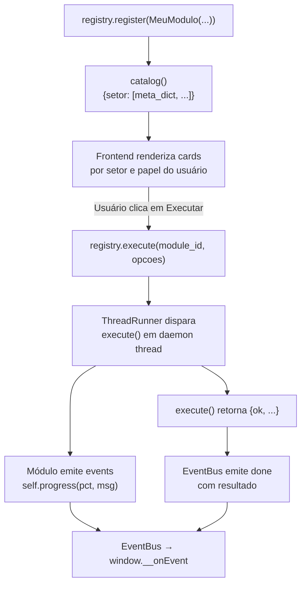

# Catálogo de Módulos

> Inventário dos módulos ativos da Central DMF e dos seus serviços acoplados: responsabilidade, contrato de entrada e saída, dependências e padrão de integração aplicado.

---

## Sumário

1. [Como o Sistema Descobre Módulos](#1-como-o-sistema-descobre-módulos)
2. [Catálogo](#2-catálogo)
3. [Por Módulo](#3-por-módulo)
   - [AutomacaoHorasLauncher](#automacaohoraslauncher)
   - [FiscalModule](#fiscalmodule)
   - [DPModule](#dpmodule)
   - [ContabilModule](#contabilmodule)

---

## 1. Como o Sistema Descobre Módulos

O `ModuleRegistry` é o catálogo em memória da plataforma. Módulos são registrados explicitamente em `main.py` — não há descoberta automática por diretório.

O diagrama abaixo mostra o ciclo de vida completo de um módulo, do registro até a conclusão da execução.

**Responsabilidades do `ModuleRegistry`:**

| Método | Descrição |
|---|---|
| `register(module)` | Adiciona módulo ao catálogo em memória |
| `execute(module_id, opcoes)` | Despacha execução em thread separada; retorna `{"ok": True, "status": "running"}` imediatamente |
| `catalog()` | Retorna `{setor: [meta_dict, ...]}` para o JS renderizar os cards |
| `get_status(module_id)` | Retorna estado atual do módulo (idle/running) |

---

## 2. Catálogo

A Central DMF e seus serviços acoplados têm registries independentes. A Central registra apenas os launchers de serviços; cada serviço tem seu próprio registry com os módulos de negócio que lhe pertencem.

### Módulos da Central DMF

| ID | Nome | Setor | Papéis | Padrão | Localização |
|---|---|---|---|---|---|
| `automacao_horas` | Automação de Horas | GESTÃO | admin, contabil, fiscal, dp | Padrão B (subprocess + SSO) | `dmf_engine/modules/m_automacao_horas.py` |
| `relatorio_rendimentos` | Relatório de Rendimentos | CONTÁBIL | admin, contabil | Padrão 0 (inline) | `dmf_engine/modules/m_relatorio_rendimentos.py` |

### Módulos da Automação de Horas (Serviço 1)

Registram-se no registry da própria Automação de Horas (`services/automacao_horas/`), não na Central DMF.

| ID | Nome | Setor | Papéis | Padrão | Localização |
|---|---|---|---|---|---|
| `fiscal` | Fiscal | FISCAL | admin, fiscal | Padrão A (Python externo) | `services/automacao_horas/modules/m_fiscal.py` |
| `dp` | Departamento Pessoal | DP | admin, dp | Padrão A (Python externo) | `services/automacao_horas/modules/m_dp.py` |
| `contabil` | Contábil | CONTABIL | admin, contabil | Padrão A (Python externo) | `services/automacao_horas/modules/m_contabil.py` |

> **Nota:** a lógica de negócio de `relatorio_rendimentos` fica em `services/relatorio_rendimentos/modulos/relatorio_rendimentos_isentos.py` e é importada diretamente pelo módulo da Central (sem processo separado).

---

## 3. Por Módulo

---

### AutomacaoHorasLauncher

**Arquivo:** `dmf_engine/modules/m_automacao_horas.py`

**Propósito:** Lançador da Automação de Horas a partir da Central DMF. Gera token SSO, despacha o processo Python 32-bit e aguarda o encerramento.

**Padrão aplicado:** Padrão B (subprocess) combinado com SSO por token. Consultar [design-patterns.md — SSO por Token](design-patterns.md#4-sso-por-token) e [design-patterns.md — Padrão B](design-patterns.md#6-padrão-b--binário-compilado).

**Entrada (`opcoes`):**

| Campo | Tipo | Descrição |
|---|---|---|
| — | — | Nenhum parâmetro externo; sessão é lida de `self.sessao()` |

**Saída:**

| Campo | Tipo | Descrição |
|---|---|---|
| `ok` | bool | `True` se o processo filho iniciou e encerrou sem erro |
| `erro` | str | Presente apenas se `ok = False` |

**Dependências:**

| Dependência | Tipo |
|---|---|
| `secrets`, `tempfile`, `subprocess` | Biblioteca padrão Python |
| `services/automacao_horas/main.py` | Processo filho (Python 32-bit) |
| `self.sessao()` | Sessão ativa da Central DMF |

**Fluxo resumido:**

1. Obtém sessão do usuário logado na Central.
2. Gera token aleatório (`secrets.token_hex(16)`).
3. Cria arquivo `dmf_session_<token>.json` em `temp/` com expiração de 30 segundos.
4. Lança `py -3-32 services/automacao_horas/main.py --session-token <token>`.
5. Retorna `{"ok": True}` quando o processo filho encerra.

---

### FiscalModule

**Arquivo:** `services/automacao_horas/modules/m_fiscal.py`

**Propósito:** Extrai horas fiscais do ERP Domínio via ODBC e injeta os valores calculados na coluna correspondente da planilha master.

**Padrão aplicado:** Padrão A — módulo Python com regras em `modulos/fiscal.py`, adaptado via BaseModule.

**Entrada (`opcoes`):**

| Campo | Tipo | Obrigatório | Descrição |
|---|---|---|---|
| `data_inicio` | str (ISO) | Sim | Início da competência fiscal (mês -2) |
| `data_fim` | str (ISO) | Sim | Fim da competência fiscal |
| `master_path` | str | Não | Caminho da planilha master (fallback: `config.json`) |

**Saída:**

| Campo | Tipo | Descrição |
|---|---|---|
| `ok` | bool | Sucesso da operação |
| `erro` | str | Mensagem de erro (presente se `ok = False`) |
| `tipo` | str | `"lock"` se o lock cooperativo foi negado |

**Dependências ativas (`services/automacao_horas/`):**

| Dependência | Descrição |
|---|---|
| `engine/database.py` | Conexão ODBC ao Sybase |
| `engine/master_writer.py` | Escrita na planilha master sem quebrar fórmulas |
| `engine/lock_master.py` | Lock cooperativo (adquire/libera `.dmflock`) |
| `modulos/fiscal.py` | Regras de negócio: GELOGUSER, adicional 80% |

**Notas:**

- A competência fiscal é mês -2 em relação ao mês corrente.
- O módulo adquire lock cooperativo antes de qualquer escrita. Libera no `finally`.
- O papel mínimo para executar é `fiscal` ou `admin`.

---

### DPModule

**Arquivo:** `services/automacao_horas/modules/m_dp.py`

**Propósito:** Calcula e injeta horas do Departamento Pessoal na planilha master. Executa em duas fases distintas: importação da planilha Carol e injeção na master.

**Padrão aplicado:** Padrão A — regras em `modulos/dp.py`, fluxo multifase controlado por `opcoes["fase"]`.

**Entrada (`opcoes`):**

| Campo | Tipo | Obrigatório | Descrição |
|---|---|---|---|
| `fase` | int | Sim | `1` = importar Carol (file dialog); `2` = injetar master |
| `master_path` | str | Não | Caminho da planilha master (fase 2) |
| `data_inicio` | str (ISO) | Sim (fase 2) | Início da competência DP (mês -1) |
| `data_fim` | str (ISO) | Sim (fase 2) | Fim da competência DP |

**Saída:**

| Campo | Tipo | Descrição |
|---|---|---|
| `ok` | bool | Sucesso da operação |
| `carol_path` | str | Caminho da planilha Carol selecionada (fase 1, se `ok`) |
| `erro` | str | Mensagem de erro (presente se `ok = False`) |
| `tipo` | str | `"lock"` se lock negado (fase 2) |

**Dependências ativas (`services/automacao_horas/`):**

| Dependência | Descrição |
|---|---|
| `engine/excel_parser.py` | Leitura da planilha Carol |
| `engine/master_writer.py` | Escrita na coluna Q da master |
| `engine/lock_master.py` | Lock cooperativo |
| `modulos/dp.py` | Regras de negócio: fórmula em cascata, exceções |

**Notas:**

- A fase 1 abre um `webview.create_file_dialog()` (síncrono) para o usuário selecionar a planilha Carol.
- A fase 2 usa o caminho da planilha selecionada na fase 1.
- A competência DP é mês -1 em relação ao mês corrente.
- O papel mínimo é `dp` ou `admin`.

---

### ContabilModule

**Arquivo:** `services/automacao_horas/modules/m_contabil.py`

**Propósito:** Processa horas contábeis em duas fases: extração do Domínio para planilha intermediária e injeção na master após validação manual da coluna R.

**Padrão aplicado:** Padrão A — regras em `modulos/contabil_preenchedor.py` e `modulos/contabil_integrador.py`, fluxo de 3 fases (2 automatizadas + 1 manual).

**Entrada (`opcoes`):**

| Campo | Tipo | Obrigatório | Descrição |
|---|---|---|---|
| `fase` | int | Sim | `2` = processar (ODBC → planilha intermediária); `5` = injetar master |
| `master_path` | str | Não | Caminho da planilha master (fase 5) |
| `data_inicio` | str (ISO) | Sim | Início da competência contábil (mês -1) |
| `data_fim` | str (ISO) | Sim | Fim da competência contábil |

**Saída:**

| Campo | Tipo | Descrição |
|---|---|---|
| `ok` | bool | Sucesso da operação |
| `arquivo_contabil` | str | Caminho de `HORAS CONTABEIS.xlsx` gerado (fase 2, se `ok`) |
| `erro` | str | Mensagem de erro (presente se `ok = False`) |
| `tipo` | str | `"lock"` se lock negado (fase 5) |

**Dependências ativas (`services/automacao_horas/`):**

| Dependência | Descrição |
|---|---|
| `engine/database.py` | Consulta ODBC ao Sybase |
| `engine/master_writer.py` | Escrita na coluna R da master |
| `engine/lock_master.py` | Lock cooperativo |
| `modulos/contabil_preenchedor.py` | Fase 2: ODBC → `HORAS CONTABEIS.xlsx` |
| `modulos/contabil_integrador.py` | Fase 5: Lê coluna R validada → master |

**Notas:**

- O fluxo contábil tem 3 fases: automática (fase 2) → manual (coluna R preenchida pelo usuário) → automática (fase 5).
- A fase 5 só deve ser executada após o usuário validar manualmente a planilha intermediária.
- A competência contábil é mês -1 em relação ao mês corrente.
- O papel mínimo é `contabil` ou `admin`.

---

*Última atualização: 2026-05-29*
