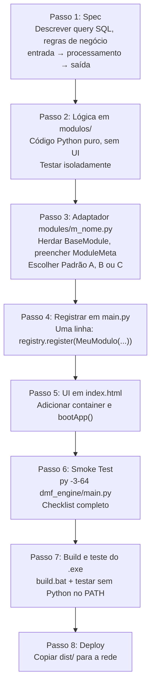

# Onboarding Técnico

> Guia para um desenvolvedor novo ficar produtivo em um dia. Cobre setup do ambiente, execução local, estrutura do repositório, padrões de código e como criar novos módulos e serviços.

---

## Sumário

0. [Antes de Implementar — Leitura Obrigatória](#0-antes-de-implementar--leitura-obrigatória)
1. [Setup do Ambiente Local](#1-setup-do-ambiente-local)
2. [Como Rodar](#2-como-rodar)
3. [Estrutura do Repositório](#3-estrutura-do-repositório)
4. [Padrões de Código](#4-padrões-de-código)
5. [Estratégia de Branches](#5-estratégia-de-branches)
6. [Pipeline de Desenvolvimento](#6-pipeline-de-desenvolvimento)
7. [Checklist de PR](#7-checklist-de-pr)
8. [Como Criar um Novo Módulo](#8-como-criar-um-novo-módulo)
9. [Como Criar um Novo Serviço](#9-como-criar-um-novo-serviço)

---

## 0. Antes de Implementar — Leitura Obrigatória

> Leia os documentos abaixo **antes de escrever qualquer código**. Esta regra se aplica a qualquer mudança — nova feature, bug fix, refactor ou novo serviço.

| Tarefa | Documentos obrigatórios |
|---|---|
| Qualquer alteração no código | [arquitetura.md](arquitetura.md) + [design-patterns.md](design-patterns.md) |
| Novo módulo ou alteração em módulo existente | + [modulos.md](modulos.md) |
| Regras de negócio (fiscal, dp, contábil) | + [regras-de-negocio.md](regras-de-negocio.md) |
| Build, deploy, segurança, observabilidade | + [operacoes.md](operacoes.md) |
| Integrar novo serviço | [design-patterns.md](design-patterns.md) seções 4-7 + [modulos.md](modulos.md) |

### Por que isso importa

A Central DMF tem invariantes que não são óbvias pelo código: o lock cooperativo que previne corrupção da planilha master, o contrato de retorno `{"ok": bool}` que o JS espera em todos os caminhos, e a separação plataforma/serviço que determina onde cada linha de código deve viver.

Pular a leitura significa reimplementar padrões que já existem, ou quebrar invariantes silenciosamente.

---

## 1. Setup do Ambiente Local

O projeto usa um **único interpretador Python 64-bit** (`py -3-64`). A antiga coexistência 32/64-bit foi eliminada — ver [migracao-64bit.md](legacy/migracao-64bit.md).

### Instalação das Dependências

```
py -3-64 -m pip install pyinstaller pywebview openpyxl pyodbc
py -3-64 -m pip install --pre pythonnet
```

### Configuração do ODBC

O acesso ao ERP Domínio (SQL Anywhere 17) é **DSN-less**: basta o driver **SQL Anywhere 17 (64-bit)** instalado na máquina. Não é necessário registrar DSN em `odbcad32.exe` — a conexão é montada por `DRIVER=SQL Anywhere 17;Host=...;Port=...`. Sem o driver, os módulos Fiscal e DP não se conectam.

### config.json

Na primeira execução, o app cria `config.json` no diretório de execução. Preencher manualmente após o primeiro boot (conexão DSN-less):

```json
{
    "master_path": "C:\\OneDrive\\CONTROLE DE HORAS DMF.xlsm",
    "db_driver": "SQL Anywhere 17",
    "db_server": "<engine/server>",
    "db_host": "<host>",
    "db_port": 2638,
    "db_database": "contabil",
    "db_uid": "EXTERNO",
    "db_pwd": "<senha_no_ambiente>"
}
```

A senha **nunca** deve ser versionada.

---

## 2. Como Rodar

### Central DMF (dev)

```
py -3-64 dmf_engine/main.py
```

A Central e a Automação de Horas rodam no **mesmo interpretador 64-bit**. A Automação é carregada in-process pela Central (sem subprocesso) — ver [arquitetura.md — Seção 3](arquitetura.md#3-comunicação-entre-componentes--sessão-compartilhada).

### Automação de Horas standalone (dev)

```
py -3-64 services/automacao_horas/main.py
```

### Build do executável

```
build.bat
```

O executável gerado estará em `dist/DMF Engine/`. Para distribuição, consultar [operacoes.md](operacoes.md).

---

## 3. Estrutura do Repositório

```
N8N automacao/
├── dmf_engine/             Central DMF (plataforma 64-bit)
│   ├── main.py             Bootstrap: registra módulos, abre janela
│   ├── api.py              Bridge JS ↔ Python
│   ├── auth.py             Autenticação: PBKDF2, machine binding
│   ├── core/               EventBus, ThreadRunner, ConfigManager
│   ├── modules/            Plugin system: base.py, registry.py, módulos
│   └── ui/index.html       SPA frontend (Vanilla JS)
│
├── services/
│   └── automacao_horas/    Serviço in-process (ODBC Sybase, 64-bit)
│       ├── main.py         Bootstrap standalone (execução direta em dev)
│       ├── engine/         ODBC, lock, master writer, estado
│       ├── modules/        Adaptadores Fiscal, DP, Contábil
│       └── modulos/        Regras de negócio puras
│
├── engine/                 Dependência residual da Central (em transição)
├── modulos/                Dependência residual da Central (em transição)
├── config/nao_faz_setor/   Arquivos de exceção por setor
├── docs/                   Documentação técnica (este diretório)
├── build.bat               Pipeline de build
└── run.bat                 Atalho para rodar em dev
```

> `engine/` e `modulos/` na raiz são dependências residuais da Central DMF que ainda não foram migradas para `services/automacao_horas/`. Detalhes em [arquitetura.md — Estado de Transição](arquitetura.md#6-estado-de-transição-da-central).

---

## 4. Padrões de Código

### Princípios Gerais

- **Retorno antecipado:** preferir `return` cedo a condicionais aninhadas.
- **Separação de responsabilidades:** `modulos/` contém apenas lógica de negócio pura — sem UI, sem threading, sem referência a `dmf_engine`. Os adaptadores em `modules/` fazem a ligação.
- **Funções focadas:** máximo de 80 linhas por função. Arquivos acima de 200 linhas devem ser divididos.
- **Nomes de domínio:** usar nomes específicos do negócio (`MasterWriter`, `FiscalModule`, `LockCooperativo`) — evitar genéricos como `utils`, `helpers`, `common`.

### Tratamento de Exceções

Todo `execute()` deve capturar exceções e retornar `{"ok": False, "erro": "..."}` com mensagem legível por não-técnicos. Nunca deixar uma exceção chegar ao JS.

```python
try:
    resultado = self._processar(opcoes)
    return {"ok": True, **resultado}
except Exception as e:
    log.error(traceback.format_exc())
    return {"ok": False, "erro": str(e)}
```

### Imports Lazy

Importar bibliotecas pesadas (`openpyxl`, `pyodbc`) apenas dentro de `execute()`, nunca no topo do arquivo. O custo de um `import` repetido é desprezível; o ganho no tempo de boot é mensurável.

### Contrato de Retorno

Todo módulo retorna `dict` com `ok: bool`. Ver detalhes em [design-patterns.md — Contrato de Retorno](design-patterns.md#10-contrato-de-retorno).

### Lock Cooperativo

Qualquer módulo que escreva na planilha master deve adquirir lock antes e liberá-lo no `finally`. Ver [design-patterns.md — Lock Cooperativo](design-patterns.md#3-lock-cooperativo).

### Logging

```python
import logging
log = logging.getLogger("NomeDoModulo")

log.info("Conectando ao Domínio...")
log.warning("Cliente sem match: %s", codi_emp)
log.error("Falha ao gravar master: %s", traceback.format_exc())
```

Não usar `print()` em produção. O `RotatingFileHandler` já está configurado — os módulos só precisam usar `logging.getLogger`.

---

## 5. Estratégia de Branches

| Branch | Uso |
|---|---|
| `main` | Produção estável — o que os usuários estão usando |
| `feat/<nome>` | Desenvolvimento de novo módulo ou funcionalidade |

**Regras durante o desenvolvimento:**

- Módulo novo cria **arquivos novos** — nunca editar módulos existentes em produção.
- Só tocar em `main.py` para adicionar uma linha de `registry.register(...)`.
- `engine/` é somente leitura — branch específica se precisar alterar.
- Merge na `main` apenas após smoke test completo (ver seção 6, Passo 6).

---

## 6. Pipeline de Desenvolvimento

O diagrama abaixo representa o caminho completo do zero à produção.



### Passo 1 — Spec

Antes de escrever código, documentar:
- Query SQL (se houver ODBC)
- Regra de negócio: entrada → processamento → saída
- Campos do objeto `opcoes` e do retorno esperado

### Passo 2 — Lógica em `modulos/`

O código de negócio deve funcionar sem UI, sem threading e sem `dmf_engine`. Testar isoladamente com `py -3-64 modulos/meu_modulo.py` antes de integrar.

### Passo 3 — Adaptador em `modules/m_nome.py`

Herdar `BaseModule`, preencher `ModuleMeta` com `id`, `nome`, `setor`, `papeis`, `icon`, `color`. Implementar `execute(opcoes)`. Escolher Padrão A, B ou C conforme [design-patterns.md — Árvore de Decisão](design-patterns.md#árvore-de-decisão--qual-padrão-de-integração-usar).

### Passo 4 — Registrar em `main.py`

Uma única linha no bloco de registro de módulos:

```python
from dmf_engine.modules.m_estagiarios import EstagiariosModule
_registry.register(EstagiariosModule(_bus, _config, _sessao_fn))
```

### Passo 5 — UI em `index.html`

1. Adicionar container: `<div class="app-container" id="app-container-<id>" style="display:none">`
2. Criar função `bootApp<Nome>()` com `registerModuleHandlers`
3. Adicionar linha de hide em `pfVoltarParaModulos()`

### Passo 6 — Smoke Test

```
py -3-64 dmf_engine/main.py
```

Checklist:
- [ ] App abre sem erros no console
- [ ] Login funciona
- [ ] Módulo aparece no catálogo no setor correto
- [ ] Apenas usuários com papel correto veem o card
- [ ] Botão executa e eventos `progress` chegam via `window.__onEvent`
- [ ] Botão `← Módulos` volta sem erros ou estado residual

### Passo 7 — Build e Teste do `.exe`

```
build.bat
```

Testar `dist/DMF Engine/DMF Engine.exe` como usuário leigo: sem Python no PATH, sem o repositório aberto.

### Passo 8 — Deploy

Copiar `dist/DMF Engine/` para a pasta de rede. Usuários executam `Instalar DMF Engine.bat`.

---

## 7. Checklist de PR

### Código

- [ ] Imports lazy dentro de `execute()`
- [ ] `try/except` cobrindo todo `execute()` com `log.error` + `traceback`
- [ ] `self.progress()` em pelo menos 4 pontos intermediários
- [ ] `adquirir_lock()` + `liberar_lock()` no `finally` se escrever na master
- [ ] Retorno `{"ok": bool}` em todos os caminhos de código
- [ ] Mensagens de erro legíveis por não-técnicos

### UI

- [ ] Prefixo de IDs único em todos os elementos HTML do módulo
- [ ] `registerModuleHandlers` chamado no boot do módulo
- [ ] `pfVoltarParaModulos()` esconde o container corretamente
- [ ] Barra de progresso aparece ao executar e some ao concluir

### Qualidade

- [ ] Sem caminhos de máquina hardcoded (usar `config.json`)
- [ ] Módulo invisível para papéis sem permissão
- [ ] Nenhum arquivo sensível commitado

---

## 8. Como Criar um Novo Módulo

Um módulo é um arquivo Python que herda `BaseModule` e é registrado no `ModuleRegistry`. Seguir os passos da seção 6.

Exemplo mínimo de módulo:

```python
# dmf_engine/modules/m_exemplo.py
from dmf_engine.modules.base import BaseModule, ModuleMeta

class ExemploModule(BaseModule):

    @property
    def meta(self) -> ModuleMeta:
        return ModuleMeta(
            id="exemplo",
            nome="Exemplo",
            desc="Descrição do módulo.",
            setor="FISCAL",
            icon="ti-file",
            color="#B06A00",
            papeis=["admin", "fiscal"],
        )

    def execute(self, opcoes: dict) -> dict:
        import traceback
        try:
            self.progress(10, "Iniciando...")
            # lógica aqui
            self.progress(100, "Concluído.")
            return {"ok": True}
        except Exception as e:
            import logging
            logging.getLogger("ExemploModule").error(traceback.format_exc())
            return {"ok": False, "erro": str(e)}
```

---

## 9. Como Criar um Novo Serviço

**Default: Padrão 0 (inline).** Um serviço novo roda no mesmo processo 64-bit da Central — um módulo que herda `BaseModule`, registrado com uma linha em `main.py`. Sem subprocesso, sem token de sessão. Use Padrão A/B/C apenas quando houver razão explícita (projeto Python externo com arquitetura própria, binário em outra linguagem, ou daemon HTTP). Ver [design-patterns.md — Árvore de Decisão](design-patterns.md).

### Estrutura típica de um serviço maior

Quando o serviço tem lógica substancial própria (caso da Automação de Horas e do Buscar XML), organize sob `services/` com pacotes de **prefixo exclusivo** para evitar colisão com a raiz da Central:

```
services/novo_servico/
├── main.py          Bootstrap standalone (execução direta em dev)
├── ns_engine/       Infraestrutura específica (prefixo exclusivo)
├── ns_modules/      Adaptadores (herdam BaseModule)
└── ns_modulos/      Regras de negócio puras
```

> ⚠️ Não use nomes de pacote genéricos (`engine/`, `config/`, `core/`, `modules/`) dentro de `services/` — eles colidem com a raiz e os imports falham silenciosamente. Ver [design-patterns.md — Padrão A](design-patterns.md#6-padrão-a--projeto-python-externo) e a memória `colisao-pacotes-engine-config`.

### Acoplamento na Central DMF

Criar `dmf_engine/modules/m_novo_servico.py` que herda `BaseModule` e injeta o serviço de forma lazy. A sessão do usuário logado vem de `self.sessao()` — não há token nem login separado, pois tudo roda no mesmo processo.

Ver implementação de referência em `dmf_engine/modules/m_buscar_xml.py` (Padrão A inline) e `dmf_engine/modules/m_automacao_horas.py` (launcher in-process que reaproveita a sessão da Central).

---

*Última atualização: 2026-06-18*
