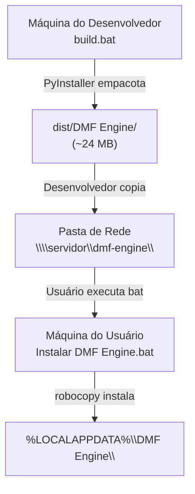

# Operações — Build, Deploy e Segurança

> Guia operacional para quem mantém a Central DMF: pré-requisitos, build, publicação, instalação, segurança, observabilidade e troubleshooting.

---

## Sumário

1. [Pré-requisitos](#1-pré-requisitos)
2. [Build](#2-build)
3. [Publicação na Rede](#3-publicação-na-rede)
4. [Instalação na Máquina do Usuário](#4-instalação-na-máquina-do-usuário)
5. [Estrutura do App Instalado](#5-estrutura-do-app-instalado)
6. [Segurança](#6-segurança)
7. [Observabilidade](#7-observabilidade)
8. [Troubleshooting Técnico](#8-troubleshooting-técnico)
9. [Gestão de Exceções por Setor — Automação de Horas](#9-gestão-de-exceções-por-setor--automação-de-horas)

---

## 1. Pré-requisitos

### Máquina de Desenvolvimento

| Item | Versão | Justificativa |
|---|---|---|
| Python 64-bit | 3.x (`py -3-64`) | Interpretador único da Central e dos serviços (ver [migracao-64bit.md](legacy/migracao-64bit.md)) |
| PyInstaller | recente | `py -3-64 -m pip install pyinstaller` |
| pythonnet | 3.1.0rc1+ pré-release | `py -3-64 -m pip install --pre pythonnet` (cp314 disponível apenas em pré-release) |
| pywebview | recente | `py -3-64 -m pip install pywebview` |
| openpyxl, pyodbc | recente | Dependências diretas das regras de negócio |

### Máquina do Usuário

- Windows 10 ou superior
- Driver **SQL Anywhere 17 (64-bit)** instalado — a conexão é DSN-less (DRIVER+host+porta), sem DSN por máquina
- Acesso à pasta de rede com o instalador
- Acesso ao OneDrive corporativo (planilha master sincronizada)

---

## 2. Build

O diagrama abaixo ilustra o fluxo completo, da máquina do desenvolvedor até a máquina do usuário.



### Executar o Build

Na raiz do projeto:

```
build.bat
```

O script executa, nesta ordem:

1. **Limpa** os diretórios `build/` e `dist/` anteriores.
2. **Empacota** via PyInstaller com `dmf_engine.spec` (modo `onedir`, console oculto, ícone embarcado).
3. **Copia** os templates de exceção (`config/nao_faz_setor/*.txt`) para `dist/DMF Engine/config/nao_faz_setor/`.
4. **Copia** o `Instalar DMF Engine.bat` para dentro de `dist/DMF Engine/`.
5. **Remove** arquivos de estado de desenvolvimento (`config.json`, logs, `supervisores.json`, `estado_compartilhado.json`) para que nada vaze para a rede.

### Arquivos do Build

| Arquivo | Função |
|---|---|
| `build.bat` | Script principal de build |
| `dmf_engine.spec` | Spec do PyInstaller — `console=False`, `onedir`, hidden imports |
| `dmf_engine/ui/logo.ico` | Ícone do executável, atalho e taskbar |
| `Instalar DMF Engine.bat` | Instalador executado pelo usuário |

---

## 3. Publicação na Rede

1. Execute `build.bat` na máquina de desenvolvimento.
2. Teste o executável gerado: clique em `dist/DMF Engine/DMF Engine.exe`, faça login e rode um módulo.
3. Copie a pasta `dist/DMF Engine/` **inteira** para `\\servidor\dmf-engine\DMF Engine\`, substituindo o conteúdo anterior.
4. Avise os usuários para executar `Instalar DMF Engine.bat` da rede.

> **Atenção:** nunca copiar apenas o `.exe`. O diretório `_internal/` também muda entre versões — copiar só o executável dessincroniza as bibliotecas e gera erro de importação na inicialização.

---

## 4. Instalação na Máquina do Usuário

1. Abrir a pasta da rede no Explorer.
2. Duplo clique em **Instalar DMF Engine.bat**.

O instalador executa automaticamente:

- Copia o app para `%LOCALAPPDATA%\DMF Engine\` (pasta do próprio usuário).
- Usa `robocopy /XO` — sobrescreve apenas arquivos mais antigos, preservando `config.json`, `supervisores.json`, logs e estado local.
- Recria o atalho **"DMF Engine"** na área de trabalho com `IconLocation` explícito.
- Executa `ie4uinit -show` para forçar refresh do cache de ícones do Windows.
- Pergunta se quer abrir o app.

---

## 5. Estrutura do App Instalado

```
%LOCALAPPDATA%\DMF Engine\
├── DMF Engine.exe           (executável principal — 5.7 MB)
├── _internal\               (bibliotecas Python empacotadas)
├── config\
│   └── nao_faz_setor\
│       ├── DP NAO.txt
│       ├── NAO FAZ CONTABIL.txt
│       └── FISCAL_NAO.txt
├── config.json              (caminhos: master, OneDrive; DSN; senha do banco)
├── supervisores.json        (usuários com hash PBKDF2 + máquina autorizada)
├── dmf_engine.log           (log geral — rotativo, máx. 50 MB)
└── dmf_engine_errors.log    (somente WARNING/ERROR/CRITICAL)
```

Os arquivos `config.json` e `supervisores.json` são criados na primeira execução e **não são sobrescritos** pelo instalador (`robocopy /XO`). Edições manuais de configuração persistem entre atualizações.

---

## 6. Segurança

### Autenticação

| Mecanismo | Descrição |
|---|---|
| PBKDF2-SHA256 | Hash das senhas com salt — nunca armazenadas em texto plano |
| Machine Binding | Cada usuário é vinculado a uma máquina específica (campo `maquina` em `supervisores.json`) |
| Papéis | `admin`, `fiscal`, `contabil`, `dp` — cada módulo restringe visibilidade por papel |
| Sessão em memória | Sessão ativa existe apenas enquanto o app está aberto; sem persistência de token entre sessões |

### Lock Cooperativo

O lock cooperativo previne que dois usuários escrevam na planilha master simultaneamente. O mecanismo usa o arquivo `.dmflock` no mesmo diretório da planilha master no OneDrive.

A criação via `open(path, 'x')` é atômica no Windows. O segundo processo recebe `FileExistsError` imediatamente — sem polling ou espera.

O lock é **sempre liberado no `finally`** do módulo, mesmo em caso de exceção. Um lock não liberado bloqueia todos os outros usuários até que o arquivo `.dmflock` seja deletado manualmente.

### Dados Sensíveis

- Credenciais do banco (`config.json`) — nunca versionadas; existem apenas na máquina do usuário.
- Planilhas master e dados de clientes — bloqueados pelo `.gitignore`.
- Logs — contêm apenas metadados de operação, sem dados de clientes.

---

## 7. Observabilidade

### Logs Rotativos

Dois arquivos de log no diretório de instalação:

| Arquivo | Conteúdo | Configuração |
|---|---|---|
| `dmf_engine.log` | Todos os eventos INFO e acima | 10 MB por arquivo × 5 backups = máx. 50 MB |
| `dmf_engine_errors.log` | Apenas WARNING, ERROR, CRITICAL | 10 MB × 5 backups |

Formato: `YYYY-MM-DD HH:MM:SS [NÍVEL] mensagem`

### Estado Compartilhado

O arquivo `estado_compartilhado.json` (no OneDrive) registra o estado de execução dos módulos de forma visível a todos os usuários. O dashboard exibe o estado em tempo real.

Estrutura simplificada:

```json
{
    "modulo_em_execucao": "fiscal",
    "usuario": "<usuario_logado>",
    "iniciado_em": "2026-05-29T14:30:00",
    "progresso": { "pct": 40, "msg": "Conectando ao Domínio..." }
}
```

---

## 8. Troubleshooting Técnico

| Sintoma | Causa Provável | Solução |
|---|---|---|
| `IM002 / IM014: driver/data source not found` | Driver SQL Anywhere 64-bit ausente, ou string de conexão usando `DSN=` em vez de DSN-less | Instalar o driver **SQL Anywhere 17 (64-bit)**; a conexão deve ser DSN-less (`DRIVER=SQL Anywhere 17;Host=...`) — ver [migracao-64bit.md](legacy/migracao-64bit.md) |
| `404 NOT FOUND ... index.html` ao abrir o `.exe` | `RESOURCES_DIR` mal configurado em modo frozen | `RESOURCES_DIR` deve usar `sys._MEIPASS/dmf_engine/` — ver `dmf_engine/main.py` |
| Atalho com ícone genérico do Python | Cache de ícone do Windows + `.lnk` antigo | Reinstalar pelo `.bat` — ele força refresh com `ie4uinit -show` |
| `ModuleNotFoundError: clr` | Falta `pythonnet` instalado | `py -3-64 -m pip install --pre pythonnet` |
| App não abre, nada acontece | Windows Defender/SmartScreen | Botão direito no `.exe` → Propriedades → Desbloquear |
| OneDrive mostra arquivo como "online-only" | `.xlsm` ou `.dmflock` não sincronizado localmente | Forçar download no Explorer (botão direito → "Manter sempre neste dispositivo") |
| Planilha master corrompida após gravação | `keep_vba` não configurado corretamente | `.xlsm` → `keep_vba=True` obrigatório; `.xlsx` → omitir ou `keep_vba=False` |
| Valores absurdos de clientes sem horas | Loop itera apenas clientes com horas no banco | Inverter o loop: iterar **todas** as linhas da planilha e gravar zero quando sem dados |

---

## 9. Gestão de Exceções por Setor — Automação de Horas

As exceções são gerenciadas por arquivos de texto em `config/nao_faz_setor/`:

| Arquivo | Setor | Efeito |
|---|---|---|
| `DP NAO.txt` | DP | Coluna Q recebe `"DP NÃO"` ou `"1:30"` (consultoria) |
| `NAO FAZ CONTABIL.txt` | Contábil | Coluna P recebe `"NAO FAZ CONTABIL"` |
| `FISCAL_NAO.txt` | Fiscal | Cliente ignorado no preenchimento da coluna O |

### Formato dos Arquivos de Exceção

Cada linha identifica uma empresa por código, nome ou combinação:

```
988    LE BRUT INDUSTRIA E COMERCIO DE ROUPAS
993    LE BRUT INDUSTRIA (FAZ CONSULTORIA, LANCAR APENAS 1:30)
AGRO EMPRESA FANTASIA LTDA
Não entra - sistema próprio    HOLDING FANTASIA LTDA
```

O separador pode ser tab (`\t`) ou ponto-e-vírgula (`;`). A ordem de prioridade de match é: código numérico → CNPJ → nome.

> Para adicionar uma empresa às exceções: editar o arquivo `.txt` correspondente na pasta `config/nao_faz_setor/` na máquina onde o app está instalado. Não é necessário rebuild.

---

*Última atualização: 2026-05-29*
