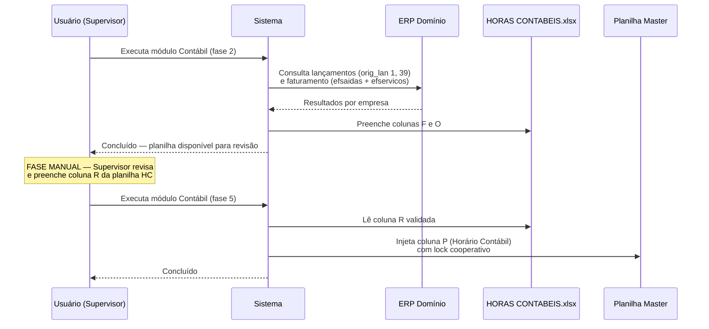
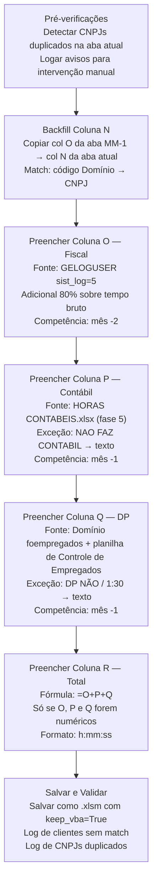

# Regras de Negócio — Automação de Horas

> **Escopo:** Regras de negócio do primeiro serviço da plataforma Central DMF. Cada serviço futuro terá seu próprio documento de regras.

> **Fonte da verdade ativa.** Este documento substitui os specs individuais em `docs/legacy/Specs_Definitivos/` como referência normativa. As specs originais são preservadas para consulta histórica e rastreabilidade.

---

## Sumário

1. [Conceito de Competência](#1-conceito-de-competência)
2. [Planilha Master](#2-planilha-master)
3. [Regras Fiscal](#3-regras-fiscal)
4. [Regras DP](#4-regras-dp)
5. [Regras Contábil](#5-regras-contábil)
6. [Sistema de Exceções](#6-sistema-de-exceções)
7. [Pipeline Geral de Preenchimento](#7-pipeline-geral-de-preenchimento)
8. [Nota de Autoridade](#8-nota-de-autoridade)

---

## 1. Conceito de Competência

Cada setor trabalha com um mês de referência diferente em relação ao mês em que o processo é executado.

| Setor | Competência | Exemplo (execução em maio/2026) |
|---|---|---|
| Fiscal | Mês atual − 2 | março/2026 |
| DP (Departamento Pessoal) | Mês atual − 1 | abril/2026 |
| Contábil | Mês atual − 1 | abril/2026 |

Essa defasagem existe porque os dados do ERP Domínio para o mês corrente ainda não estão consolidados quando a automação é executada.

---

## 2. Planilha Master

A planilha master (`CONTROLE DE HORAS DMF.xlsm`) é o **produto final consolidado** do processo de automação. Reúne, em uma aba por mês (`MM.AAAA`), o tempo total de trabalho da equipe DMF por cliente, distribuído em três setores.

### Estrutura de Colunas

| Coluna | Nome | Fonte | Preenchido por |
|---|---|---|---|
| H | Código Domínio (`codi_emp`) | Manual/importação | Planilha |
| I | Nome Fantasia | Manual/importação | Planilha |
| J | CNPJ | Manual/importação | Planilha |
| K | Razão Social | Manual/importação | Planilha |
| N | Mês Anterior — Fiscal (backfill) | Coluna O do mês anterior | Automação (Fiscal) |
| O | Horário Fiscal | GELOGUSER + adicional 80% | Automação (Fiscal) |
| P | Horário Contábil | Planilha HORAS CONTABEIS.xlsx | Automação (Contábil) |
| Q | Horário Pessoal (DP) | Domínio `foempregados` + fórmula | Automação (DP) |
| R | Total (`=O+P+Q`) | Fórmula Excel | Automação (etapa final) |

Dados começam na **linha 10** (linhas 1-9 são cabeçalhos). Formato das células de tempo: `[h]:mm:ss`.

### Lookup Duplo — Identificação de Cliente

Para garantir que nenhum cliente seja omitido, a localização da linha na planilha usa **dois campos redundantes**:

```
1ª tentativa → Código Domínio (coluna H)
2ª tentativa → CNPJ (coluna J)
Se nenhum bater → cliente ausente da planilha (registrar em log)
```

Alguns clientes têm a coluna H preenchida com textos especiais em vez de código numérico. Nesses casos, o sistema **não busca por código** e usa o CNPJ como único critério.

| Valor na Coluna H | Significado | Comportamento |
|---|---|---|
| `Não entra - sistema próprio` | Usa ERP próprio | Não buscar no Domínio; lookup por CNPJ |
| `Não esta na Dominio` | Sem cadastro no ERP | Não buscar no Domínio; lookup por CNPJ |
| `Não entra - Consultoria` | Consultoria eventual | Verificar regras de consultoria |

**CNPJs duplicados** na planilha indicam erro de cadastro. O sistema alerta no log e não preenche automaticamente nenhuma das linhas — aguarda intervenção manual.

---

## 3. Regras Fiscal

O módulo Fiscal captura o tempo real que cada colaborador DMF passou trabalhando dentro do módulo Escrita Fiscal do ERP Domínio.

**Fonte:** Tabela `bethadba.geloguser`, filtro `sist_log = 5` (código do módulo Escrita Fiscal).

**Sessões excluídas:** `tfim_log IS NULL` — representam crash ou desconexão, não são produtivas.

**Extração:** `DATEDIFF(second, ...)` — obrigatório em segundos. O uso de minutos causa arredondamentos e os valores divergem do relatório oficial do Domínio.

### Adicional de 80%

O tempo extraído do Domínio representa apenas o tempo de login no sistema. Existe overhead real (comunicação, alinhamento, correções) que não é capturado. Por isso, aplica-se um adicional obrigatório de **80%** sobre o tempo bruto antes de gravar na planilha.

```
tempo_final = tempo_bruto × 1.80
valor_excel = tempo_final / 86400  (fração de dia)
```

O adicional é aplicado **por empresa** (sobre o total somado de todos os colaboradores), não por sessão individual.

### Backfill da Coluna N

A cada mês processado, a coluna N da aba atual recebe o valor da coluna O da aba do mês anterior para o mesmo cliente. Regra válida a partir de dezembro/2025. Se a aba anterior não existir, o backfill é ignorado sem erro.

---

## 4. Regras DP

O módulo DP calcula o tempo estimado de processamento da folha de pagamento com base no número de empregados ativos de cada cliente.

**Fonte:** Tabela `bethadba.foempregados` + planilha de Controle de Empregados do DP (entrada manual, `Controle de Empregados MM.xls`).

**Tipos de empregados computados:** funcionários CLT (`vinculo=1`), estagiários (`vinculo=6`) e contribuintes individuais (`vinculo=11`).

### Fórmula em Cascata

```
se total_empregados > 0:
    horas_dp = (total_empregados × 0.33) + 1.5   [em horas]

se total_empregados = 0:
    horas_dp = 00:05:00   [mínimo obrigatório]
```

Empresas sem empregados ativos no mês nunca recebem zero — o mínimo de 5 minutos é obrigatório.

### Fluxo em Duas Fases

O módulo DP opera em duas fases distintas dentro da interface:

| Fase | Ação | Tipo |
|---|---|---|
| Fase 1 | Usuário seleciona a planilha de Controle de Empregados (file dialog) | Síncrono |
| Fase 2 | Sistema calcula e injeta coluna Q na master | Thread assíncrona |

A fase 2 só executa se a fase 1 foi concluída com sucesso.

---

## 5. Regras Contábil

O módulo Contábil processa em três fases (duas automáticas e uma manual).

**Fase 2 — Processamento (automático):** Extrai do Domínio a quantidade de lançamentos contábeis (`bethadba.ctlancto`, `orig_lan IN (1, 39)`) e o faturamento total (`bethadba.efsaidas` + `bethadba.efservicos`). Grava os resultados na planilha intermediária `HORAS CONTABEIS.xlsx`.

**Fase manual:** Após a fase 2, o responsável contábil revisa e preenche manualmente a **coluna R** da planilha `HORAS CONTABEIS.xlsx`. Esta etapa é obrigatória e não pode ser automatizada.

**Fase 5 — Injeção (automático):** Após a validação manual, o sistema lê a coluna R validada e injeta os valores na coluna P da planilha master.

O diagrama abaixo ilustra o fluxo sequencial das três fases.



### Regra de Lançamentos Contábeis

Filtrar obrigatoriamente pelos códigos de origem `orig_lan IN (1, 39)`:

| Origem | Significado |
|---|---|
| `1` | Lançamento contábil normal |
| `39` | Conciliação bancária / extrato via importação |

A origem `39` foi incluída após validação com clientes reais (1283 e 3). Filtrar apenas a origem `1` subestima a produtividade contábil.

---

## 6. Sistema de Exceções

Alguns clientes não fazem determinados serviços na DMF. A automação lida com isso via arquivos de exceção, não diretamente no código.

| Arquivo | Localização | Efeito na Planilha |
|---|---|---|
| `DP NAO.txt` | `config/nao_faz_setor/` | Coluna Q recebe `"DP NÃO"` (sem folha) ou `"1:30"` (consultoria) |
| `NAO FAZ CONTABIL.txt` | `config/nao_faz_setor/` | Coluna P recebe `"NAO FAZ CONTABIL"` |

### Flags do Arquivo DP NAO.txt

| Flag no arquivo | Valor gravado em Q |
|---|---|
| Sem flag | `"DP NÃO"` |
| `FAZ CONSULTORIA, LANCAR APENAS 1:30` | `"1:30"` (overhead fixo) |
| `Não entra - sistema próprio` | `"DP NÃO"` |

**Consequência para a coluna R:** Se Q ou P contiver texto, a fórmula `=O+P+Q` quebra. O sistema deve verificar antes de inserir a fórmula e, quando houver texto, calcular o total manualmente ou deixar a célula em branco.

---

## 7. Pipeline Geral de Preenchimento

O diagrama abaixo representa a sequência correta de execução a cada mês. As etapas devem ser executadas nesta ordem.



**Regra de ouro:** A planilha master sempre é salva como `.xlsm` com `keep_vba=True`. Salvar como `.xlsx` perde as macros. Usar `keep_vba=True` em `.xlsx` corrompe o arquivo.

---

## 8. Nota de Autoridade

Este documento é a **fonte da verdade ativa** para as regras de negócio da **Automação de Horas** (primeiro serviço da plataforma Central DMF) a partir de 2026-05-29.

Os documentos em [`docs/legacy/Specs_Definitivos/`](legacy/Specs_Definitivos/) contêm versões anteriores das mesmas regras, preservadas para consulta histórica e rastreabilidade. Em caso de discrepância entre este documento e os specs legados, este documento prevalece.

As queries SQL completas das specs originais (`QUERY_*.md`) estão preservadas em `docs/legacy/Specs_Definitivos/` e não foram migradas para cá — são detalhes de implementação, não regras de negócio.

---

*Última atualização: 2026-05-29*
